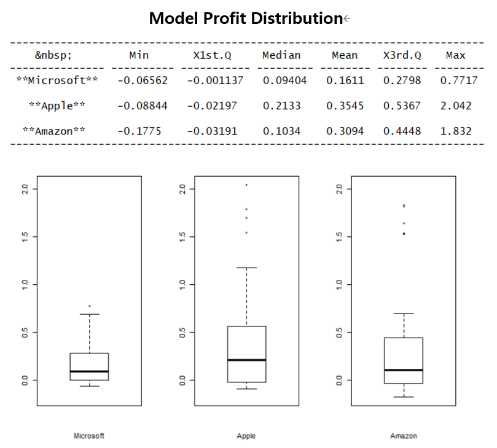

# LSTM Price trend estimator

Research project by Woo June Cha under supervision of professor Chad Shafer from Carnegie Mellon University.

## Abstract
For non-financial experts, it is difficult to determine when to enter a position in a stock market. The objective of this project is to build a machine learning model, that could estimate the price trend and identify price trend shifts. We can exploit the model output to make trade decisions that would yield profit.

## Method
Use an LSTM binary classification model to estimate either we are at an up trend of a down trend, and take actions (enter, exit) according to trend shifts. 

## Result
Backtest results of Microsoft, Amazon and Apple stock on 40 different time periods. 

